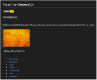

# Readme Generator
${licenseimg}
## Description
#
#### 
QByter 2023

sfdfdsdf fdsfdd sdfdfdf dsffasdf
dThis is test tes dsfdfd
sfdsfdsfdf

dsffdsfa
df
df
f
ds
sdfg

fd
ds
dfsf

 
${description}
## Table of Contents
#
- [Description](#description)
- [Installation](#installation)
- [Usage](#usage)
- [License](#license)
- [Contributing](#contributing)
- [Tests](#tests)
- [Questions](#questions)
## Installation
#
## Usage
#

## License
#
### ${licensetext}
## Contributing
#
## Tests
#
## Questions
#

 
 
 
 
 
 
 
 
 
 
Inline-style: 

1. First ordered list item
2. Another item
⋅⋅* Unordered sub-list. 
1. Actual numbers don't matter, just that it's a number
⋅⋅1. Ordered sub-list
4. And another item.

⋅⋅⋅You can have properly indented paragraphs within list items. Notice the blank line above, and the leading spaces (at least one, but we'll use three here to also align the raw Markdown).

⋅⋅⋅To have a line break without a paragraph, you will need to use two trailing spaces.⋅⋅
⋅⋅⋅Note that this line is separate, but within the same paragraph.⋅⋅
⋅⋅⋅(This is contrary to the typical GFM line break behaviour, where trailing spaces are not required.)

* Unordered list can use asterisks
- Or minuses
+ Or pluses

#

Apache
Apache 2.0 License

Boost
Boost Software License 1.0
License

BSD
BSD 3-Clause License
License

BSD 2-Clause License
License

Creative Commons
Choose on CreativeCommons.org

CC0
License: CC0-1.0

License: CC0-1.0